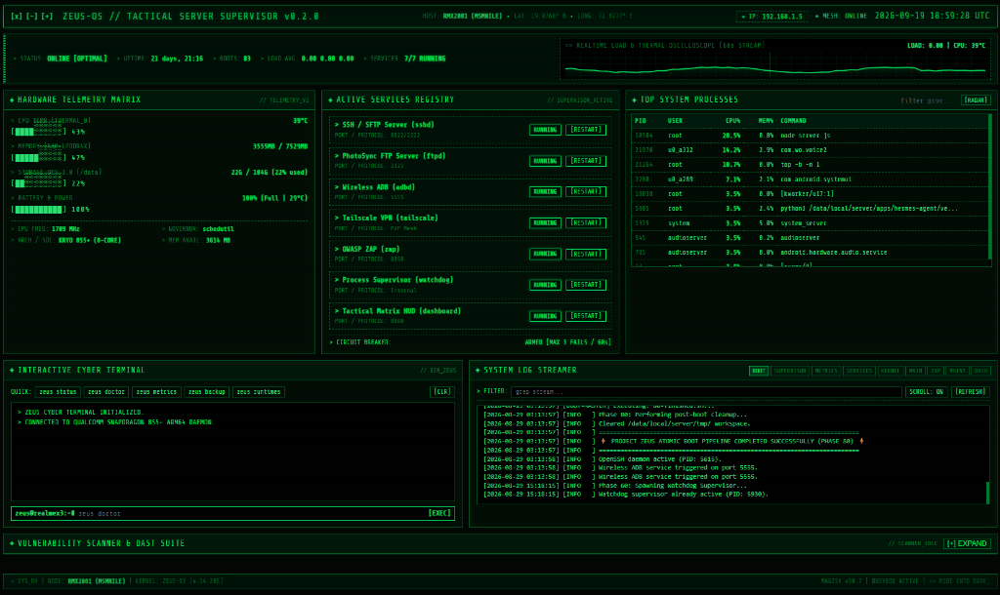

# Project Zeus: Autonomous Headless Android ARM Server

```text
 ███████╗███████╗██╗   ██╗███████╗
 ╚══███╔╝██╔════╝██║   ██║██╔════╝
   ███╔╝ █████╗  ██║   ██║███████╗
  ███╔╝  ██╔══╝  ██║   ██║╚════██║
 ███████╗███████╗╚██████╔╝███████║
 ╚══════╝╚══════╝ ╚═════╝ ╚══════╝
 HEADLESS ANDROID ARM SERVER INFRASTRUCTURE
```

[](LICENSE)
[](docs/PROJECT.md)
[](docs/BOOT.md)
[](bin/zeus)
[](apps/zeus-dashboard)
[](docs/NETWORK.md)
[](docs/SECURITY.md)

**Project Zeus** turns old, broken-screen, or retired Android phones into 24/7 headless ARM Linux servers and home lab nodes. 

Operating 100% headlessly with zero screen dependency, Zeus functions like an always-on, self-healing Linux microserver capable of hosting web services, background telemetry daemons, security auditing scanners, and automation bots—all backed by the smartphone's built-in battery as an **Uninterruptible Power Supply (UPS)**.

<p align="center">
  
  <br>
  <em>Project Zeus Tactical Matrix HUD — Real-time telemetry, service supervisor, cyber terminal, live log streamer, and DAST vulnerability scanner running headlessly on Snapdragon 855+.</em>
</p>

---

## ⚡ Why Turn a Smartphone into a Server? (vs Raspberry Pi)

Old flagship smartphones (such as the Qualcomm Snapdragon 845, 855+, 865, or Tensor series) are often discarded due to cracked glass or dead display panels. Yet under the hood, they outperform common single-board computers while consuming less power and offering built-in redundancy:

| Feature | Qualcomm Snapdragon 855+ (e.g. Realme X3) | Raspberry Pi 4 Model B | Raspberry Pi 5 |
| :--- | :--- | :--- | :--- |
| **CPU Architecture** | 8-Core Kryo 485 (1x 2.96 GHz + 3x 2.42 GHz + 4x 1.78 GHz) | 4-Core Cortex-A72 @ 1.5 GHz | 4-Core Cortex-A76 @ 2.4 GHz |
| **RAM** | 8 GB LPDDR4X (Dual-Channel) | 4 GB / 8 GB LPDDR4 | 4 GB / 8 GB LPDDR4X |
| **Internal Storage** | **128 GB UFS 3.0 (~1400 MB/s Read)** | MicroSD Card (~30–80 MB/s) | MicroSD Card (~80 MB/s) |
| **Built-in UPS Battery** | **Yes (4,200 mAh, 4–8 hours blackout runtime)** | ❌ No (Requires external UPS HAT) | ❌ No (Requires external UPS HAT) |
| **Network Interfaces** | Wi-Fi 802.11ac, Bluetooth 5.0, 4G LTE Modem | Wi-Fi 802.11ac, Gigabit Eth | Wi-Fi 802.11ac, Gigabit Eth |
| **Idle Power Consumption**| **~1.2 W – 2.5 W** | ~3.5 W – 5.0 W | ~4.5 W – 6.5 W |
| **Cooling / Acoustics** | 100% Silent (Passive dissipation) | Requires noisy active fan | Requires active fan |
| **Hardware Cost** | **$0 (Repurposed broken device from your drawer)** | $75 – $120+ (with PSU & case) | $80 – $130+ (with PSU & case) |

---

## 👥 Who Is This For?

- 🏠 **Home Lab & Self-Hosting Enthusiasts**: Run lightweight microservices, AdGuard Home, Pi-hole, Vaultwarden, or personal cloud endpoints on silent, low-power (~1.5W) hardware with built-in battery blackout protection.
- 💻 **Developers & DevOps Engineers**: An always-on physical ARM64 Linux testbed for compiling packages, testing multi-arch builds, running scheduled cron jobs, or hosting Telegram automation bots without paying monthly VPS bills.
- 🛡️ **Cybersecurity Analysts & Pentesters**: A discreet, portable, battery-powered attack and audit drone loaded with ProjectDiscovery Nuclei and OWASP ZAP for automated web vulnerability assessments.
- 📸 **Mobile Media & Backup Enthusiasts**: High-speed dedicated PhotoSync FTP server and HTTP photo upload endpoint that triggers Android's MediaScanner automatically to ingest photos into device storage.
- 🎓 **Students & Budget Builders**: Get high-end smartphone silicon (Snapdragon 855+ / 8GB RAM / 128GB UFS 3.0) for $0 out of a drawer, outperforming a $100+ Raspberry Pi kit while learning real-world Linux, POSIX shell, and Android internals.
- ♻️ **Hardware Hackers & E-Waste Reducers**: Giving broken-screen flagship smartphones a productive second life as 24/7 autonomous microservers instead of letting them end up in landfills.

---

## 🏗️ System Architecture

Unlike traditional Linux distributions, Android lacks standard init systems like `systemd` or `SysVinit`. Furthermore, traditional Android startup solutions (like `Termux:Boot`) frequently fail on broken-screen devices because `BOOT_COMPLETED` broadcast intents get delayed or blocked by battery optimizations when the lockscreen is not dismissed.

Project Zeus solves this with a **Magisk `service.d` late-start boot hook** coupled with an atomic 10-phase POSIX shell pipeline and an autonomous process watchdog supervisor:

```
[ Android 10-14 Power On / Reboot ]
                 │
                 ▼
     [ Magisk Late-Start Boot ]
   /data/adb/service.d/99-zeus.sh
                 │
                 ▼
    /data/local/server/scripts/zeus-boot-entry.sh
                 │
  ┌──────────────┴───────────────────────────────────────────────────────┐
  │                                                                      │
  ▼                                                                      ▼
00-bootstrap.sh  ───> Sync with sys.boot_completed=1, Wakelock fallback chain
05-filesystem.sh ───> Verify 14 core directories, increment boot counter
10-network.sh    ───> Poll wlan0 interface, record dynamic IP state
20-adb.sh        ───> Enable Wireless ADB on TCP port 5555
30-ssh.sh        ───> Start OpenSSH / Dropbear daemon (Port 8022/2222)
40-tmux.sh       ───> Spawn detached persistent 'zeus-main' session
50-services.sh   ───> Parse data-driven registry units (services/*.conf)
60-watchdog.sh   ───> Launch self-healing supervisor & metrics collector
70-health.sh     ───> Capture baseline thermal, RAM, and storage audit
80-finished.sh   ───> Purge volatile tmp, verify log sizes, signal COMPLETE
```

---

## 🌟 Core Features

### 1. 🛡️ Self-Healing Circuit-Breaker Supervisor (`watchdog/supervise.sh`)
- **Data-Driven Registry**: Dynamically discovers `.conf` units in `services/`.
- **Automatic Recovery**: If a service (SSH, Dashboard, FTP, Tailscale) crashes, the watchdog detects it within 15 seconds and automatically restarts it.
- **Circuit Breaker**: If a service crashes more than 3 times within 60 seconds, the supervisor trips the circuit breaker to prevent infinite crash-restart loops and battery drain.
- **Telemetry Gathering**: Continuously logs CPU temperature, battery temperature, battery capacity, charging status, CPU frequency/governor, RAM, swap, and disk usage to `logs/metrics.log`.

### 2. 🖥️ Tactical Phosphor Green Matrix CRT HUD (`apps/zeus-dashboard`)
Built with zero external npm dependencies using native Node.js:
- **Real-Time Dynamic Oscilloscope**: 60 FPS HTML5 Canvas graph visualising CPU load and thermal fluctuations.
- **Server-Sent Events (SSE)**: Sub-second streaming telemetry (`/api/stream`) updating temperatures, frequencies, and memory without page refreshes.
- **Interactive Web CLI Console**: Execute authorized `zeus` administrative commands directly from your browser.
- **Service Control Matrix**: View status and toggle server services with one click.
- **Top Processes Inspector**: Live process list displaying CPU% and memory consumption.
- **Embedded Vulnerability Scanner**: Trigger Nuclei or OWASP ZAP scans and view rendered HTML reports directly in the HUD.

### 3. 🎯 Remote Vulnerability Scanner Suite (Nuclei & OWASP ZAP)
- Single-command vulnerability scanner for web applications: `zeus scan <URL> [nuclei|zap-baseline|zap-active]`.
- Includes a dedicated Windows client PowerShell script (`scripts/pc-client/scan-site.ps1`) for dispatching scans remotely from your desktop.
- Automatically compiles findings into clean, responsive HTML reports served directly over HTTP.

### 4. 📸 High-Speed PhotoSync FTP & Media Receiver
- Dedicated Python FTP server (`bin/photo_ftp_server.py`) running on port 2121 and HTTP upload endpoint (`/api/upload-photo`).
- Direct integration with Android's MediaScanner (`am broadcast -a android.intent.action.MEDIA_SCANNER_SCAN_FILE`) so newly uploaded photos immediately register in device galleries and cloud backup apps.

### 5. 🌐 Tiered Ingress & Encrypted Remote Access
- **Local LAN**: Wireless ADB (`port 5555`), SSH (`port 8022/2222`), Matrix HUD (`port 8080`).
- **Remote P2P Mesh**: Native Tailscale WireGuard daemon running in userspace mode (`--tun=userspace-networking`) for secure access from anywhere without port forwarding.
- **Public Routing**: Ready for Cloudflare Tunnel (`cloudflared`) reverse proxy.

---

## 🛠️ The `zeus` Command-Line Interface

All administrative operations are unified into a single POSIX-compliant binary (`bin/zeus`):

```text
Project Zeus Server Management Interface (zeus)

Usage: zeus <command> [options]

Commands:
  status          Display overall system health, networking, runtimes, & service statuses
  logs [name]     View system logs (boot|watchdog|metrics|services|main|dashboard)
  metrics         Display real-time CPU thermal, memory, and hardware telemetry
  restart <name>  Restart a specific registered service (e.g. sshd, adbd, tailscale, zap, dashboard)
  scan <url>      Run vulnerability scan on target URL (nuclei|zap-baseline|zap-active)
  scanner [op]    Manage scanner suite (status|setup|reports)
  tailscale [op]  Manage Tailscale P2P mesh VPN (status|up|down|setup)
  runtimes        Install/update Node.js (LTS), Python 3, Git, and build tools
  doctor          Run system diagnostic checks and environment audit
  backup          Create a compressed system configuration archive
  update          Apply local repository script updates
  reboot          Perform a clean system reboot
```

---

## 💡 The Cold-Start Breakthrough: Controlling a Broken-Screen Phone

The biggest hurdle with repurposing a broken-screen device is the **ADB authorization prompt**:
```text
$ adb devices
4b1bfc87    unauthorized
```
Normally, Android requires you to tap **"Allow USB Debugging"** on the screen. If the display is shattered or touch is unresponsive, you are locked out.

### The Key Injection Hack
Instead of giving up on the hardware, you can pre-authorize your computer from custom recovery:
1. Boot into **TWRP / Recovery** via Fastboot (`fastboot flash recovery twrp.img` && `fastboot reboot recovery`). Recovery ADB runs unauthenticated.
2. Mount the `/data` partition (`adb shell mount /data`).
3. Push your workstation's public ADB key directly into Android's trusted key store:
   ```bash
   adb push "%USERPROFILE%\.android\adbkey.pub" /data/misc/adb/adb_keys
   adb shell chown system:shell /data/misc/adb/adb_keys
   adb shell chmod 640 /data/misc/adb/adb_keys
   ```
4. Reboot into Android (`adb reboot`). Android reads `/data/misc/adb/adb_keys`, recognizes your PC as a pre-authorized host, and exposes a fully authorized shell without touching the screen.

> 📖 *For the full 16-stage journey—including kernel boot patching, ROM stability trade-offs, and Doze whitelisting—see [docs/COLD_START_RECOVERY.md](docs/COLD_START_RECOVERY.md).*

---

## 🚀 Getting Started

### Prerequisites
1. **Rooted Android Smartphone** (ARM64, Android 10 or later recommended).
2. **Magisk v24+** installed with `su` access.
3. **BusyBox** installed (via Magisk module or Termux).
4. **Termux** installed on the device (provides Node.js, Python, and OpenSSH packages).
5. **USB Debugging** enabled in Developer Options.

---

### Option 1: Fast Automated Deployment (via Workstation ADB)

1. Connect your phone to your computer via USB (or ensure Wireless ADB is active).
2. Clone this repository on your computer:
   ```bash
   git clone https://github.com/<your-username>/project-zeus.git
   cd project-zeus
   ```
3. Run the automated deployment script:
   ```bash
   # If connected via USB:
   ./scripts/deploy.sh

   # Or if deploying over Wi-Fi:
   ./scripts/deploy.sh --adb-ip 192.168.1.50
   ```
4. The deployment script will:
   - Establish the `/data/local/server/` hierarchy on the device.
   - Synchronize all binaries, startup scripts, service configs, and dashboard files.
   - Register the late-start boot hook in `/data/adb/service.d/99-zeus.sh`.

---

### Option 2: Direct Local Deployment (Termux / Root Shell)

If you prefer to deploy directly from the device shell:

```bash
# Clone or copy project files into Termux
git clone https://github.com/<your-username>/project-zeus.git
cd project-zeus

# Switch to root and execute deployment
su
sh scripts/deploy.sh --local
```

---

### Verifying the Installation

Open an ADB or SSH shell on the device and verify the deployment:

```bash
# Verify system environment and dependencies
/data/local/server/bin/zeus doctor

# Check running services and IP addresses
/data/local/server/bin/zeus status

# View real-time hardware telemetry
/data/local/server/bin/zeus metrics
```

Open your computer's browser and navigate to:
```text
http://<PHONE_IP>:8080
```
You will be greeted by the **Project Zeus Tactical Phosphor Green Matrix HUD**!

---

## 🖥️ Desktop PC Client Utilities (`scripts/pc-client/`)

For workstations running Windows (or adaptable for Linux/macOS), Project Zeus includes native desktop automation tools:

### 1. Remote Vulnerability Scanning (`scan-site.ps1`)
Dispatch security scans directly from your PowerShell terminal to the phone server. The server executes Nuclei or OWASP ZAP, streams real-time stdout back to your console, and automatically opens the rendered HTML report in your browser:
```powershell
# Run a fast Nuclei CVE scan against a web app:
.\scripts\pc-client\scan-site.ps1 -Target https://example.com -Profile nuclei -PhoneIP 192.168.1.50

# Run an OWASP ZAP baseline passive spider:
.\scripts\pc-client\scan-site.ps1 -Target https://example.com -Profile zap-baseline -PhoneIP 192.168.1.50
```

### 2. Cold Display Mirroring with `scrcpy` (`start-scrcpy.ps1` / `start-scrcpy.bat`)
When you need to interact with the Android GUI or sideload an APK without heating up the physical phone display:
```powershell
# Connect wirelessly with physical screen 100% powered off:
.\scripts\pc-client\start-scrcpy.ps1 -TargetIP 192.168.1.50

# Or using USB ADB:
.\scripts\pc-client\start-scrcpy.ps1
```
*The device screen stays completely black (0% OLED backlight emission), eliminating display heat while streaming the screen at 60 FPS to your desktop.*

---

## ⚙️ Adding Custom Services

Adding a new service to Project Zeus takes 30 seconds. Simply create a `.conf` file inside `/data/local/server/services/`:

```sh
# /data/local/server/services/my-bot.conf

NAME="my-bot"
PROCESS="python3 bot.py"
START="cd /data/local/server/apps/my-bot && python3 bot.py >/data/local/server/logs/my-bot.log 2>&1 &"
STOP="pkill -f 'python3 bot.py'"
ENABLED=1
MAX_FAILURES=3
WINDOW_SECONDS=60
```

The watchdog supervisor automatically detects new units on its next cycle and supervises them without requiring a reboot.

---

## 🔋 Hardware Safety & Battery Swelling Prevention

Running a smartphone connected to power 24/7 requires proper battery management to prevent thermal expansion and degradation:

1. **Software Charge Limiting (Recommended)**: Use the **Advanced Charging Controller (ACC)** Magisk module to limit battery charge between 60% and 70% (float voltage under 3.92V):
   ```bash
   su -c "acc 70 60"
   ```
2. **Screen-Off Headless Wakelock**: Project Zeus disables `stay_on_while_plugged_in` and acquires a **CPU-only Partial Wakelock**. The physical OLED/LCD panel stays completely dark, reducing idle heat by ~10°C.
3. **Passive Airflow**: Remove phone cases and rest the device on an open aluminum stand. A quiet 5V USB fan pointed at the backplate can drop full-load temperatures by an additional 12°C–18°C.
4. For detailed hardware analysis and battery-bypass modding instructions, see [docs/HARDWARE_GUIDE.md](docs/HARDWARE_GUIDE.md).

---

## 📂 Target Filesystem Hierarchy (`/data/local/server/`)

To keep Android system folders clean, all server components reside under `/data/local/server/`:

```text
/data/local/server/
├── bin/          # Administrative CLI binary (zeus), FTP server, scanner runners
├── config/       # Persistent configuration files (tailscale, ssh, services)
├── logs/         # Centralized log streams (boot, watchdog, metrics, dashboard)
├── runtime/      # Volatile runtime PID files, current IP cache, sockets
├── services/     # Data-driven service registry definitions (*.conf units)
├── maintenance/  # Debian-style maintenance runners (daily/, weekly/, monthly/)
├── startup/      # Ordered atomic boot scripts (00-bootstrap to 80-finished)
├── watchdog/     # Self-healing process supervisor & circuit breaker
├── state/        # Persistent state tracking (boot count, last boot, service state)
├── cache/        # Application runtime cache storage
├── tmp/          # Volatile temporary directory (purged on boot)
├── backups/      # Automated system configuration backups
├── lib/          # Shared POSIX shell function libraries (logging.sh)
├── apps/         # Application microservices (zeus-dashboard, bots, APIs)
└── reports/      # Generated vulnerability scan reports (HTML/TXT)
```

---

## 📑 Documentation Suite

- 📐 **[ARCHITECTURE.md](docs/ARCHITECTURE.md)** — Detailed layered architecture, filesystem separation, and component interactions.
- ⚡ **[BOOT.md](docs/BOOT.md)** — Complete 10-phase boot sequence, wakelock fallback chain, and synchronization mechanics.
- 📱 **[HARDWARE_GUIDE.md](docs/HARDWARE_GUIDE.md)** — Device compatibility matrix, SoC recommendations, battery care, and thermal cooling.
- 🌐 **[NETWORK.md](docs/NETWORK.md)** — Wireless ADB setup, SSH hardening, Tailscale WireGuard mesh, and Cloudflare tunnels.
- 🔒 **[SECURITY.md](docs/SECURITY.md)** — Security trust boundaries, permission separation, and vulnerability reporting.
- 📝 **[DECISIONS.md](docs/DECISIONS.md)** — Architectural Decision Records (ADRs 001–006) explaining engineering trade-offs.
- 🐛 **[KNOWN_ISSUES.md](docs/KNOWN_ISSUES.md)** — Hardware quirks, Doze mode mitigations, and solutions.
- 🗺️ **[ROADMAP.md](docs/ROADMAP.md)** — Future enhancements (Docker/chroot containers, AI agent hosting, reverse proxies).
- 💡 **[COLD_START_RECOVERY.md](docs/COLD_START_RECOVERY.md)** — Cold-start breakthrough: bypassing broken-screen ADB authorization, key injection, and Magisk boot patching.
- 🤝 **[CONTRIBUTING.md](docs/CONTRIBUTING.md)** — POSIX shell style conventions and Pull Request guidelines.
- 🏷️ **[CHANGELOG.md](docs/CHANGELOG.md)** — Version release notes.

---

## 🤝 Contributing

Contributions from the self-hosting, Android development, and security communities are welcome!
1. Fork the repository.
2. Create a feature branch (`git checkout -b feature/amazing-feature`).
3. Ensure all shell scripts adhere to strict POSIX standards (`sh -n script.sh` and ShellCheck).
4. Commit your changes (`git commit -m 'feat: add awesome service unit'`).
5. Push to the branch (`git push origin feature/amazing-feature`).
6. Open a Pull Request.

---

## 📄 License

This project is open-source software licensed under the [MIT License](LICENSE).
